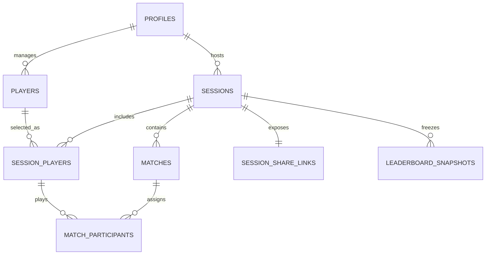

# CourtHost MVP Database Model

**Database:** PostgreSQL via Supabase  
**Companion specification:** `COURTHOST_PRODUCT_SPEC.md`

## 1. Design principles

- Use UUID primary keys.
- Store timestamps as `timestamptz` in UTC.
- Enforce important invariants in PostgreSQL, not only in React.
- Use normalized match participants instead of team-specific player columns.
- Snapshot player names and skills inside a session so historical results do not change after roster edits.
- Calculate the live leaderboard from completed matches; persist a final snapshot when the session ends.
- Use soft deletion for sessions and archive referenced players.
- Public reads go through narrowly scoped database functions using a share token. Do not grant anonymous clients broad table access.

## 2. Enumerations

```sql
create type public.session_format as enum ('singles', 'doubles');
create type public.generator_mode as enum ('random', 'skill');
create type public.session_status as enum (
  'draft', 'scheduled', 'live', 'completed', 'cancelled'
);
create type public.match_status as enum (
  'upcoming', 'playing', 'completed', 'cancelled'
);
create type public.match_side as enum ('a', 'b');
create type public.session_player_status as enum (
  'active', 'withdrawn', 'replacement'
);
```

Use migrations for enum changes; do not casually rename enum values in production.

## 3. Entity relationships



## 4. Tables

### `profiles`

One row per authenticated host. It mirrors `auth.users`.

| Column | Type | Rules |
|---|---|---|
| `id` | `uuid` | PK; FK to `auth.users(id)` |
| `display_name` | `text` | Required |
| `preferred_locale` | `text` | `en` or `id`; default `en` |
| `created_at` | `timestamptz` | Default `now()` |
| `updated_at` | `timestamptz` | Maintained by trigger |

### `players`

Permanent host-managed roster.

| Column | Type | Rules |
|---|---|---|
| `id` | `uuid` | PK |
| `host_id` | `uuid` | Required FK to `profiles(id)` |
| `name` | `text` | Required after trimming; max 100 chars |
| `skill_rating` | `smallint` | Required; check 1–10 |
| `is_archived` | `boolean` | Default `false` |
| `created_at` | `timestamptz` | Default `now()` |
| `updated_at` | `timestamptz` | Maintained by trigger |

Indexes:

```sql
create index players_host_active_idx
  on public.players (host_id, is_archived, lower(name));
```

Do not add a unique constraint on names; duplicates are allowed.

### `sessions`

| Column | Type | Rules |
|---|---|---|
| `id` | `uuid` | PK |
| `host_id` | `uuid` | Required FK to `profiles(id)` |
| `name` | `text` | Required; max 120 chars |
| `scheduled_at` | `timestamptz` | Required |
| `format` | `session_format` | Required |
| `generator_mode` | `generator_mode` | Required |
| `status` | `session_status` | Default `draft` |
| `duration_minutes` | `integer` | Required; positive |
| `estimated_match_minutes` | `integer` | Required; positive |
| `started_at` | `timestamptz` | Nullable |
| `completed_at` | `timestamptz` | Nullable |
| `cancelled_at` | `timestamptz` | Nullable |
| `deleted_at` | `timestamptz` | Nullable soft-delete marker |
| `created_at` | `timestamptz` | Default `now()` |
| `updated_at` | `timestamptz` | Maintained by trigger |

Checks:

```sql
check (duration_minutes > 0),
check (estimated_match_minutes > 0),
check (completed_at is null or status = 'completed'),
check (cancelled_at is null or status = 'cancelled')
```

Indexes:

```sql
create index sessions_host_history_idx
  on public.sessions (host_id, scheduled_at desc)
  where deleted_at is null;

create index sessions_host_status_idx
  on public.sessions (host_id, status)
  where deleted_at is null;
```

### `session_players`

Membership plus immutable-at-session snapshots.

| Column | Type | Rules |
|---|---|---|
| `id` | `uuid` | PK |
| `session_id` | `uuid` | Required FK to `sessions(id)`; cascade |
| `player_id` | `uuid` | Nullable FK to `players(id)`; `set null` if permitted operationally |
| `name_snapshot` | `text` | Required |
| `skill_snapshot` | `smallint` | Required; check 1–10 |
| `status` | `session_player_status` | Default `active` |
| `withdrawn_at` | `timestamptz` | Nullable |
| `replaces_session_player_id` | `uuid` | Nullable self-FK |
| `created_at` | `timestamptz` | Default `now()` |

Constraints:

```sql
unique (session_id, player_id)
```

The unique constraint permits multiple null `player_id` values. Normal flows should always reference a roster player; the nullable design protects historical snapshots if a roster row must later be removed.

### `matches`

| Column | Type | Rules |
|---|---|---|
| `id` | `uuid` | PK |
| `session_id` | `uuid` | Required FK to `sessions(id)`; cascade |
| `sequence_number` | `integer` | Required; positive |
| `generation_batch` | `integer` | Required; default 1; positive |
| `status` | `match_status` | Default `upcoming` |
| `side_a_score` | `smallint` | Nullable; check 0–4 |
| `side_b_score` | `smallint` | Nullable; check 0–4 |
| `started_at` | `timestamptz` | Nullable |
| `completed_at` | `timestamptz` | Nullable |
| `cancelled_at` | `timestamptz` | Nullable |
| `cancellation_reason` | `text` | Nullable; max 300 chars |
| `created_at` | `timestamptz` | Default `now()` |
| `updated_at` | `timestamptz` | Maintained by trigger |

Constraints:

```sql
unique (session_id, sequence_number),
check (sequence_number > 0),
check (generation_batch > 0),
check (side_a_score between 0 and 4),
check (side_b_score between 0 and 4),
check (
  status <> 'completed'
  or (
    side_a_score is not null
    and side_b_score is not null
    and side_a_score + side_b_score = 4
    and completed_at is not null
  )
)
```

Allow partial live scores whose sum is at most four:

```sql
check (
  side_a_score is null
  or side_b_score is null
  or side_a_score + side_b_score <= 4
)
```

Enforce one playing match per session:

```sql
create unique index matches_one_playing_per_session_idx
  on public.matches (session_id)
  where status = 'playing';
```

### `match_participants`

| Column | Type | Rules |
|---|---|---|
| `id` | `uuid` | PK |
| `match_id` | `uuid` | Required FK to `matches(id)`; cascade |
| `session_player_id` | `uuid` | Required FK to `session_players(id)` |
| `side` | `match_side` | Required |
| `position` | `smallint` | 1 for singles; 1 or 2 for doubles |
| `created_at` | `timestamptz` | Default `now()` |

Constraints:

```sql
unique (match_id, session_player_id),
unique (match_id, side, position),
check (position in (1, 2))
```

A deferred constraint trigger should verify:

- Every participant belongs to the same session as the match.
- Singles matches have exactly one player on each side.
- Doubles matches have exactly two players on each side.

### `session_share_links`

| Column | Type | Rules |
|---|---|---|
| `id` | `uuid` | PK |
| `session_id` | `uuid` | Required; unique FK to `sessions(id)`; cascade |
| `token_hash` | `text` | Required; unique |
| `token_prefix` | `text` | Optional support/debug prefix; never authenticates |
| `created_at` | `timestamptz` | Default `now()` |
| `revoked_at` | `timestamptz` | Nullable |
| `last_accessed_at` | `timestamptz` | Optional, nullable |

Generate at least 32 random bytes in the application or a trusted database function. Store only a SHA-256 hash of the bearer token. The raw token appears only in the shared URL.

### `leaderboard_snapshots`

One row per player when a session is completed.

| Column | Type | Rules |
|---|---|---|
| `id` | `uuid` | PK |
| `session_id` | `uuid` | Required FK to `sessions(id)`; cascade |
| `session_player_id` | `uuid` | Required FK to `session_players(id)` |
| `rank` | `integer` | Required; positive |
| `played` | `integer` | Required; nonnegative |
| `wins` | `integer` | Required; nonnegative |
| `draws` | `integer` | Required; nonnegative |
| `losses` | `integer` | Required; nonnegative |
| `points_for` | `integer` | Required; nonnegative |
| `points_against` | `integer` | Required; nonnegative |
| `point_difference` | `integer` | Required |
| `created_at` | `timestamptz` | Default `now()` |

Constraint:

```sql
unique (session_id, session_player_id)
```

## 5. Leaderboard calculation

Create a SQL function such as:

```sql
public.get_session_leaderboard(target_session_id uuid)
```

It should:

1. Read only `completed` matches.
2. Join each participant to their match side.
3. Add that side's score to `points_for` and the opposing score to `points_against`.
4. Count win, draw, or loss from the side result.
5. Rank by points, wins, and point difference.
6. Apply two-player head-to-head only when exactly two players remain tied after the first three criteria.
7. Return shared ranks when the tie remains unresolved.

The final head-to-head step is easiest to implement in a dedicated stable SQL function with tests. Do not bury it in frontend sorting.

## 6. Transactional database functions

Critical multi-row operations should be RPC/database functions:

### `create_session_with_players`

Creates the session, snapshots selected players, creates the share token, and optionally generates the initial schedule in one transaction.

### `regenerate_schedule`

Allowed only for `draft` or `scheduled` sessions. Deletes/replaces upcoming matches, never completed matches.

### `start_match`

- Locks the session and match rows.
- Requires session status `scheduled` or `live`.
- Rejects if another match is playing.
- Sets session to `live` when starting its first match.
- Sets the target match to `playing` and records timestamps.

### `update_live_score`

- Requires the match to be `playing`.
- Validates 0–4 per side and a combined score no greater than 4.
- Updates only the score columns.

### `finish_match`

- Locks the match row.
- Requires `playing` state.
- Requires both scores and an exact total of 4.
- Sets `completed` and timestamps.
- Does not start another match.

### `correct_match_result`

- Requires session `live` and match `completed`.
- Requires a valid four-point result.
- Replaces the score; the calculated leaderboard updates automatically.
- UI confirmation is required before calling it.

### `withdraw_player`

Marks the session player withdrawn and cancels their upcoming matches. A later generator call appends replacement future matches using current completed/scheduled appearance counts.

### `end_session`

- Locks the session.
- Requires `live`.
- Cancels upcoming/playing matches as appropriate.
- Calculates and stores `leaderboard_snapshots`.
- Sets status `completed` and timestamp.
- Makes all session result data immutable.

## 7. Row Level Security

Enable RLS on every table.

### Authenticated host policies

The host may select and mutate rows only where `host_id = auth.uid()` or where the row belongs to a session owned by `auth.uid()`.

Representative ownership predicate:

```sql
exists (
  select 1
  from public.sessions s
  where s.id = session_id
    and s.host_id = auth.uid()
    and s.deleted_at is null
)
```

Prefer calling transactional functions for state changes and revoke direct client updates to protected status/timestamp columns.

### Anonymous policies

Do not create general anonymous `select` policies on core tables.

Expose public data through a `security definer` function such as:

```sql
public.get_public_session(raw_token text)
```

The function must:

- Set a safe `search_path`.
- Hash the supplied token and compare it to `token_hash`.
- Reject revoked links and soft-deleted sessions.
- Return only the session summary, public participant snapshots, matches, and leaderboard.
- Never return host identity, internal IDs that are not needed, token hashes, or deleted data.
- Grant execute to `anon` and `authenticated`; revoke from `public` first, then grant deliberately.

Public real-time delivery should use a dedicated sanitized publication/table or Supabase Broadcast triggered from trusted database changes. Do not weaken RLS on normalized tables merely to make subscriptions convenient.

## 8. Immutability enforcement

Add triggers that reject changes when a session is `completed` or `cancelled`, except for administrative soft deletion or share-link revocation.

Protected records:

- `session_players`
- `matches`
- `match_participants`
- `leaderboard_snapshots`

The API and UI should communicate read-only state, but the database remains the final guardrail.

## 9. Deletion behavior

- Player with no references: hard delete allowed after confirmation.
- Referenced player: archive; keep snapshots.
- Session: set `deleted_at`; exclude from host queries and invalidate public access.
- Do not cascade from a roster player into historical session data.
- A privileged maintenance path may permanently purge soft-deleted sessions later; it is not exposed in the MVP UI.

## 10. Migration order

1. Extensions and common timestamp trigger
2. Enums
3. `profiles`
4. `players`
5. `sessions`
6. `session_players`
7. `matches`
8. `match_participants`
9. `session_share_links`
10. `leaderboard_snapshots`
11. Constraint triggers
12. Leaderboard and transactional functions
13. RLS policies and grants
14. Realtime publication/broadcast setup
15. Seed data for local development only

Never edit a migration that has already been applied to a shared environment. Add a new migration.

## 11. Required database tests

- Reject player skill ratings outside 1–10.
- Reject completed match scores that do not total 4.
- Allow partial live scores only when their total is at most 4.
- Prevent two playing matches in one session.
- Prevent participants from another session being assigned to a match.
- Enforce two participants for singles and four for doubles.
- Block score changes after session completion.
- Preserve completed match statistics after a withdrawal.
- Verify doubles points are credited fully to both teammates.
- Verify ranking and shared-rank behavior.
- Verify anonymous access with valid, invalid, and revoked tokens.
- Verify anonymous users cannot mutate any table.
- Verify one host cannot access another host's rows, even though the MVP currently uses one host.

